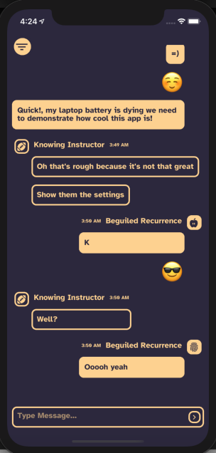
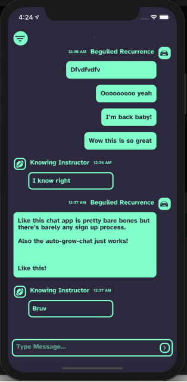
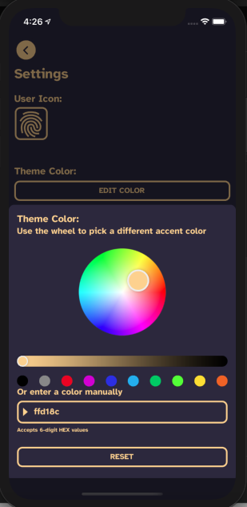
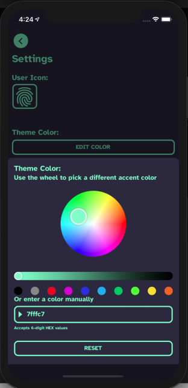
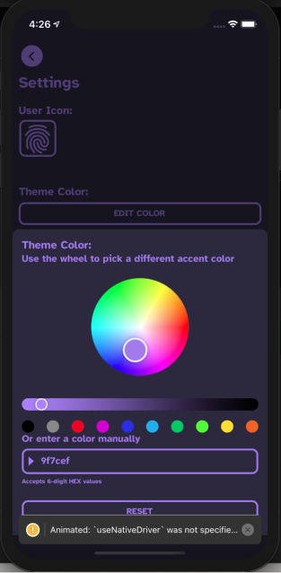
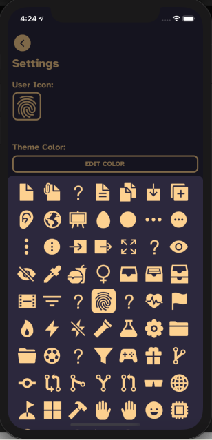

# Noise

A YikYak clone if, instead of being hyperlocal Reddit, it was just a hyperlocal chatroom.

Purely just a project to work on an end-to-end publishing something to Android/iOS app store.


# Installation

Being built with Expo, this project requires the latest `expo-cli` with `npm install -g expo-cli`

```
git clone https://github.com/actuallydan/noise0chat.git
npm install
```

To run the project on the iOS Simulator, XCode and the Additional Tools must be installed (pretty sure expo will scream about this when trying to run it).

To run the application

```
npm start
```

Press `i` to open, install, and run the dev application in XCode Simulator
Press `a` to open, install, and run in Android Emulator (must install Android Studio and run AVD)
Press `w` to run in browser, but probably not great, since this is supposed to be mobile only for simplicity?

# Contributing

Checkout to a feature branch, code & commit as usual, and then `git pull --rebase origin main` before pushing to feature branch and open a PR.

Commit messages should (try to) follow Angular style commit header.

> The message header is a single line that contains succinct description of the change containing a `type`, an optional `scope` and a `subject`.
> Allowed <type>
> This describes the kind of change that this commit is providing.
>
> - feat (feature)
> - fix (bug fix)
> - docs (documentation)
> - style (formatting, missing semi colons, …)
> - refactor
> - test (when adding missing tests)
> - chore (maintain)
>
> Allowed <scope>
> Scope can be anything specifying place of the commit change. For example screens, defaultState, packages, File.js, components/, etc...

> You can use \* if there isn't a more fitting scope.
> <subject> text
> This is a very short description of the change.
> use imperative, present tense: “change” not “changed” nor “changes”
> don't capitalize first letter
> no dot (.) at the end

Example:

```
git checkout -b feature/actuallydan/images
git add .
git commit -m 'feat(images): add new splash image'
git pull --rebase origin main
git push origin
```

# A Smattering of other pictures







